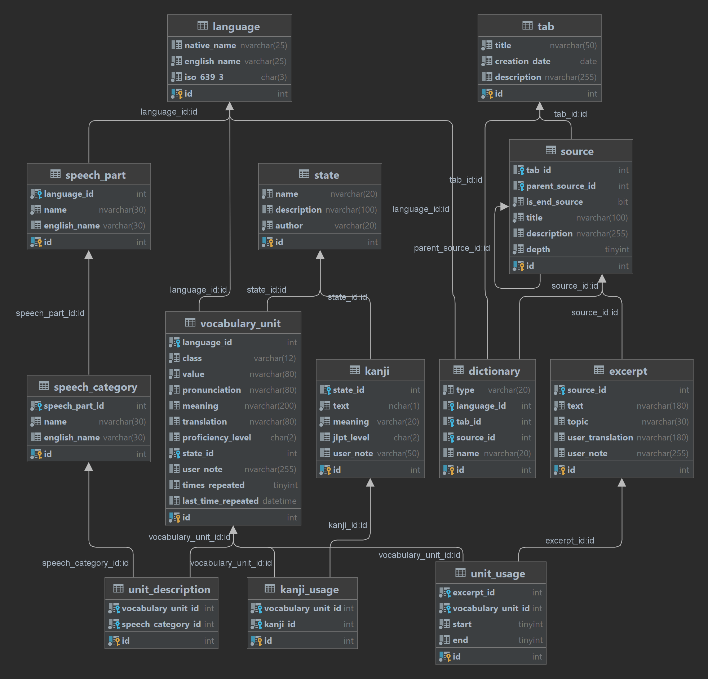

# How Database of the LegoVerbum is structured?

LegoVerbum's Database presumably will consinst of 2 parts: LegoVerbum's functionality DB (FDB) and Referential Translations and Meanings DB (RTMDB).

## Functionality DB
This part describes a core structure of the application through DB. The RTMDB should be connected to this Functionality DB. 

Right now I have a vague vision of how User can interact with the app. Basically, when LegoVerbum is launched, the User is presented with 2 Tabs: Sources and Dictionaries. The first one lets User create custom Tabs for different Sources (for instance, we can create Tab "Music", where we add 2 Sources: "Nirvana - Drain You" and "Mai Yamane - The Real Folk Blues". For each of them we add References(lyrics), that we may use to study English and Japanese. Note that the app is also intented to have the ability to combine multiple languages in one source). The second one lets User look at Dictionaries. I will expand on the functionalities further in the doc. 

### Entities and their description
#### 1. Tab
- Purpose: To contain Sources, created by User.

#### 2. Source
- Purpose: To create hierarchy for the data we extract.
- Description: Hierarchical structure allows to create deep connections between in the source material. User is not obliged to do so.
- Note: Self referential Entity, meaning that its FK parentSourceId reffers to id of the other Source.
- Note: Either tabId is null or parentSourceId is null. Both can't have values or be null at the same time.

#### 3. Excerpt
- Purpose: To be a basic source unit from which app derives words and constructions.
- Note: can connect with sourceId only if isEndSource == true.
- Note: userTranslation can be manually added by the User.

#### 4. VocabularyUnit
- Purpose: To be a basic learning unit which is used to train User
- Description: Combines together words and constructions (2 and more words). Because LegoVerbum is primarly an electronic version of User's vocabulary, it will require User to fill in the data. 
 
...
 Bovvan: I'd like to avoid such thing, however I don't have a dataset now nor do I have a clear understanding of how to implement this word classification. Anyway I will need require User's interaction with the app here. And maybe it's not a bad thing, as it will help them memorize info faster and understand the context better. Anyhow, I've been stuck at this stage for too long, time to act.
 
- Note: Meaning is a central attribute, it defines the Unit itself.d (in order to accurately translate word or construction we need to understand its meaning. For example, word "can" has multiple meaning, so in order to avoid misunderstandings, we need to speficy meaning.)
- Note: Must have states: Known, Learning, Leave For Later...

#### 5. UnitUsage
- Purpose: To link together VocabularyUnit and Excerpt.

#### 6. Kanji
- Purpose: To be additional learning Unit for Japanese and probaly Chinese in the future.
- Description: Contains JLPT Level and meaning data. Any additional data might be added in the future.

#### 7. KanjiUsage
- Purpose: To link Kanji and VocabularyUnit together.

#### 8. State
- Purpose: To store learning states for learning units (VocabularyUnit and Kanji).
- Note: Possible default states: Known, Learning, Leave For Later.
- Note: User can add custom states.

#### 9. Language
- Purpose: To store some generic info on each language.

#### 10. SpeechParts
- Purpose: To list all speech parts of each language.

#### 11. SpeechCategories
- Purpose: To extend SpeechParts with categories (verb can be transitive, godan).

#### 12. UnitDescription
- Purpose: To give information to which Part of Speech the Unit belongs (Verb: transitive, godan).
- Note: each unit may belong to multiple speech categories.

#### 13. Dictionary
- Purpose: To be a control element through wich VocabularyUnits, Kanjis and Excerpts can be retrieved by Language, by Source or by Tab.
- Note: Must exist 3 types of dictionaries: Language, Tab and Source dictionary.

## Referential Translations and Meanings DB
This section is yet to be designed. I have some ideas, however I am not sure that they will satisfy my needs. 
